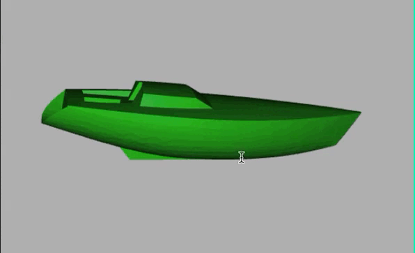

<!-- README.md is generated from README.Rmd. Please edit that file -->

# stl

```{r setup, include=FALSE, echo = FALSE}
knitr::opts_chunk$set(collapse = TRUE,
                      comment = "##",
                      fig.retina = 2,
                      fig.align = "center",
                      fig.path = "README_figs/README-")
Sys.setlocale("LC_TIME", "C")
```

## Usage

```{r echo=TRUE, message=FALSE, warning=FALSE}
library(stl)
library(rgl)
options(rgl.printRglwidget = TRUE)
boat <- stl::read_stl("inst/extdata/Boat.stl")
open3d()
triangles3d(boat, col = "green")
close3d()
```


