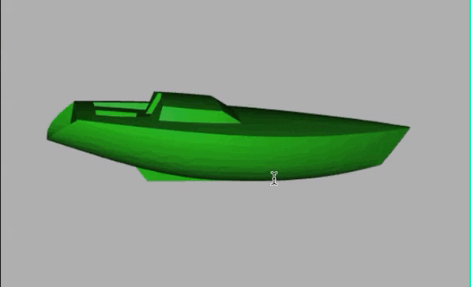

<!-- README.md is generated from README.Rmd. Please edit that file -->

# stl-package

Show 3D objects in STL file format in R.

## STL file format

The STL file format is a simple format to store 3D data. An STL file describes a raw, unstructured triangulated surface by the unit normal and vertices (ordered by the right-hand) of the triangles using a three-dimensional Cartesian coordinate system ([https://en.wikipedia.org/wiki/STL\_(file_format)](https://en.wikipedia.org/wiki/STL_(file_format)){.uri}).

Together with the RGL package function 'triangles3d()' it is possible to plot STL files very easy, see example below.

## Usage

``` r
library(stl)
library(rgl)
options(rgl.printRglwidget = TRUE)
boat <- stl::read_stl("inst/extdata/Boat.stl")
open3d()
rgl::triangles3d(boat, col = "green")
close3d()
```


